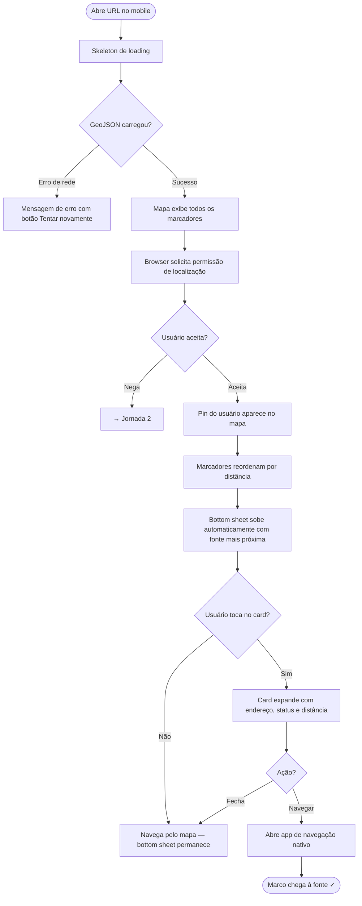
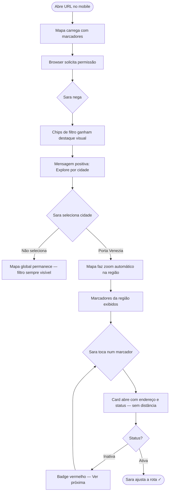
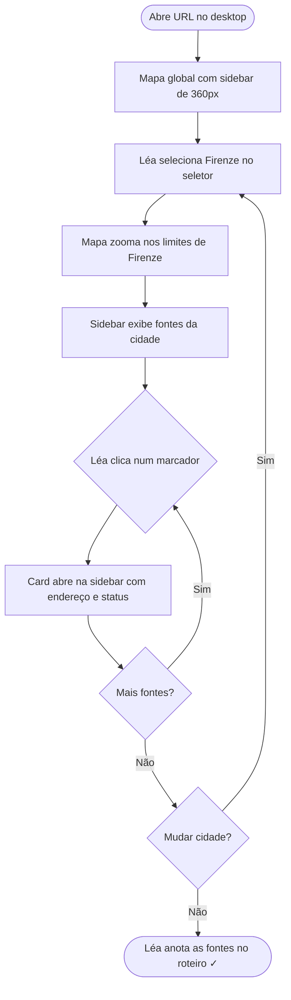
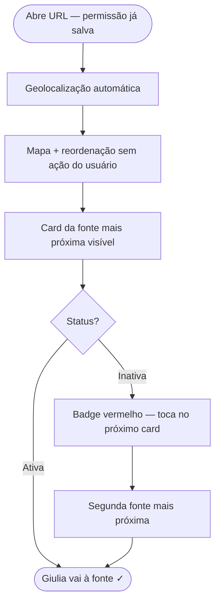

# UX Design Specification — Fontanelle Map

**Author:** Alan Raldi
**Date:** 2026-05-13

---

## Resumo Executivo (UX)

### Visão do Projeto

Fontanelle Map entrega **zero fricção entre o usuário e a água mais próxima**. A UX deve ser invisível — o usuário não deveria ter que aprender o app, ele deveria simplesmente funcionar. O desafio central é transformar dados técnicos (GeoJSON) numa experiência intuitiva em menos de 10 segundos.

### Usuários-Alvo

| Persona | Contexto de Uso | Dispositivo | Urgência |
|---|---|---|---|
| **O Caminhante** (Marco/Sara) | Em movimento, ao sol, com uma mão | Mobile | Alta — precisa de água agora |
| **O Explorador Regional** (Léa) | Em casa, sentado, planejando | Desktop | Baixa — está explorando |
| **O Cidadão Recorrente** (Giulia) | Caminhada diária, conhece o app | Mobile | Média — uso habitual |

**Insight UX crítico:** O contexto de uso primário é **móvel + outdoor + uma mão + luz solar intensa**. Isso dita contraste, tamanho de toque e densidade de informação.

### Desafios de Design

1. **Momento da permissão de localização** — pedir acesso à localização antes de mostrar valor é antipadrão. O mapa deve carregar primeiro; localização solicitada de forma contextual após.
2. **Hierarquia no card da fonte** — distância é o dado mais urgente para o Caminhante; endereço é mais útil para o Explorador. O card deve servir aos dois sem sobrecarga visual.
3. **Fallback elegante sem GPS** — GPS negado nunca deve resultar em bloqueio. O usuário deve ver o mapa completo com convite suave para filtrar por cidade.
4. **Usabilidade outdoor** — sol forte reduz contraste percebido; suor prejudica toques precisos. Interface precisa de áreas de toque generosas (mín. 44px) e contraste alto.

### Oportunidades de Design

1. **"Nearest first" automático** — ordenação instantânea por distância após conceder localização é o momento "uau" do app. Sem clique, sem configuração.
2. **Sistema de cores por status** — verde/vermelho nos marcadores cria scanabilidade instantânea: estado de uma fonte compreendido em < 1 segundo.
3. **Transição mapa → card** — slide suave do card de detalhes a partir do marcador clicado pode ser a interação assinatura que dá personalidade ao produto.

---

## Experiência Central do Usuário

### Experiência Definidora

**A ação central é uma única pergunta: "Qual é a fonte mais próxima de mim agora?"**

O sucesso é medido pelo tempo entre "usuário abre a URL" e "usuário sabe onde ir". Meta: < 10 segundos. Qualquer elemento que adie essa resposta é um problema de UX.

### Estratégia de Plataforma

- **Primária:** Web mobile (SPA), uma mão, portrait, ao ar livre
- **Secundária:** Web desktop, mouse + teclado, sentado, planejamento
- **Touch vs mouse:** Mobile é o caso de design principal. Desktop herda a estrutura mobile com adaptações (painel lateral, área de mapa maior)
- **Offline:** Fora do escopo v1 — app requer conexão para carregar GeoJSON
- **Capacidade nativa aproveitada:** Geolocation API do browser

### Interações Sem Esforço

| Interação | Como deve parecer |
|---|---|
| Carregar o mapa | Fontes aparecem antes de o usuário precisar rolar |
| Obter localização | Automático — fontes reordenam sem clique após permissão |
| Identificar status | Visual imediato — verde = ativa, vermelho = inativa, sem leitura |
| Acessar card de detalhe | Um toque no marcador — sem menus intermediários |
| Filtrar por cidade | Seletor visível — não escondido atrás de ícone |

**Comportamentos automáticos (sem ação do usuário):**
- Zoom automático na região filtrada
- Reordenação por distância após localização
- Carregamento do dataset ao abrir o app

### Momentos Críticos de Sucesso

1. **Mapa carrega** → usuário vê marcadores em < 3s. Falha aqui = jornada termina.
2. **Permissão de localização** → solicitada *depois* de o mapa já estar carregado, nunca como barreira de entrada.
3. **Fontes reordenadas** → card da fonte mais próxima aparece automaticamente. Momento "uau" sem login.
4. **Card de detalhe** → distância em destaque, status imediato, endereço legível. Um toque = todas as informações.
5. **Fallback sem GPS** → filtro de cidade exibido de forma proeminente, não como plano B escondido.

### Princípios de Experiência

1. **Velocidade antes de beleza** — performance é UX. Mapa rápido > mapa bonito.
2. **Informação no momento certo** — distância exibida apenas com geolocalização ativa.
3. **Outdoor-first** — alto contraste, toque mínimo de 44px, legível sob sol direto.
4. **Nunca bloqueante** — GPS negado, dados lentos, fonte inativa nunca impedem o usuário de avançar.
5. **Progresso visível** — o usuário sempre sabe o que está acontecendo (loading, localizando, erro).

---

## Resposta Emocional Desejada

### Objetivos Emocionais Primários

**Emoção principal: Alívio imediato → Confiança**

O Caminhante não quer se impressionar com o app — quer resolver o problema. A emoção-alvo não é "wow, que bonito", é "ótimo, sei exatamente onde ir". O produto vence quando o usuário sente que pode confiar nele toda vez que precisar.

**Secundário: Delícia pela simplicidade** — quando a fonte mais próxima aparece automaticamente sem ação do usuário, ele deve sentir que o app "entendeu o que eu precisava".

### Mapeamento da Jornada Emocional

| Momento | Emoção Desejada | Emoção a Evitar |
|---|---|---|
| App abre, mapa carrega | Confiança ("parece sólido") | Ansiedade ("será que vai funcionar?") |
| Pop-up de localização | Disposição ("faz sentido pedir aqui") | Resistência ("por que precisa da minha localização?") |
| Fontes reordenam por distância | Delícia ("não precisei fazer nada") | Confusão ("o que mudou?") |
| Card da fonte mais próxima | Alívio + Clareza ("sei onde ir") | Sobrecarga ("muita informação") |
| GPS negado / fallback | Controle ("ainda consigo usar") | Frustração ("não funciona sem localização") |
| Fonte marcada como inativa | Preparação ("vou para a próxima") | Decepção sem caminho ("e agora?") |
| Retorno ao app | Familiaridade ("já sei como funciona") | Reaprendizado ("como funcionava mesmo?") |

### Micro-Emoções Críticas

- **Confiança vs. Ceticismo** → status verde/vermelho precisa ser confiável. Fonte "ativa" quebrada destrói a confiança no produto.
- **Controle vs. Impotência** → fallback sem GPS deve parecer uma escolha ("Explore por cidade"), nunca uma mensagem de erro.
- **Leveza vs. Peso** → nenhum menu de hambúrguer, onboarding ou cadastro. Leveza é a personalidade do produto.

### Implicações de Design

| Emoção | Decisão de UX |
|---|---|
| Confiança | Mapa carrega antes de pedir localização — valor primeiro, permissão depois |
| Delícia | Animação suave quando fontes reordenam por distância |
| Alívio | Card da fonte mais próxima é o elemento visual mais proeminente |
| Controle | Fallback usa linguagem positiva ("Explore por cidade"), não negativa |
| Leveza | Zero telas de onboarding, zero modais de boas-vindas |
| Familiaridade | UI consistente entre sessões — mesmo layout, mesmos ícones |

### Princípios de Design Emocional

1. **Valor antes de permissão** — mapa funcional visível antes de qualquer solicitação de acesso
2. **Linguagem positiva em estados de erro** — nunca "falhou", sempre "tente desta forma"
3. **Feedback imediato** — sem resposta visual por mais de 200ms após qualquer ação
4. **Personalidade pela simplicidade** — ausência de complexidade é uma declaração de design

---

## Análise de Padrões UX e Inspiração

### Análise de Produtos Inspiradores

**Google Maps** — bottom sheet de POI desliza da base sem cobrir o mapa; marcadores com cores por categoria. Transferível: padrão de bottom sheet para card de detalhe.

**Citymapper** — linguagem sempre positiva em erros; hierarquia de informação clara (tempo > distância > nome). Transferível: priorização do dado mais urgente no topo do card; fallback empático.

**AllTrails** — alto contraste para leitura ao sol; áreas de toque generosas; mapa como tela principal; status com cores imediatas. Transferível: sistema de cores por status, layout minimalista com mapa dominante.

**Foursquare/Google Maps POI Cards** — informação mais importante no topo; endereço acessível mas não prioritário. Transferível: hierarquia do card: distância → status → endereço → cidade.

### Padrões UX Transferíveis

**Navegação:**
- **Bottom sheet progressivo** — card começa como preview (nome + distância), expande com tap para detalhes. Nunca cobre o mapa completamente em mobile.
- **Filtro como chips horizontais** — filtros de cidade visíveis na parte superior do mapa, sem abrir menu.

**Interação:**
- **"Snap to location"** — botão que centraliza o mapa na posição do usuário com um toque.
- **Toque em marcador → highlight + card** — marcador selecionado muda de aparência; card desliza. Padrão universal consolidado.

**Visual:**
- **Marcadores por estado com cor + ícone** — não depender só de cor para WCAG; verde com gota = ativa, vermelho com X = inativa.
- **Tipografia grande em mobile** — fonte mínima 16px; dado principal (distância) em tamanho maior que nome.

### Anti-Padrões a Evitar

| Anti-padrão | Motivo |
|---|---|
| Splash screen antes do mapa | Bloqueia o usuário urgente |
| Solicitar localização antes de mostrar valor | Taxa de rejeição alta |
| Filtros em menu hambúrguer | Usuário nunca descobre sem instrução |
| Card que cobre todo o mapa em mobile | Perde o contexto espacial |
| Erro genérico sem próximo passo | Não ajuda o usuário a agir |

### Estratégia de Inspiração de Design

**Adotar:** bottom sheet progressivo, sistema de cores + ícone por status, botão "voltar à minha localização", filtro como chips.

**Adaptar:** hierarquia do card — distância primeiro (ao contrário de apps comerciais onde nome vem primeiro).

**Evitar:** qualquer tela antes do mapa, qualquer permissão antes de carregar o mapa, menu hambúrguer como navegação principal.

---

## Sistema de Design

### Escolha do Design System

**shadcn/ui + Tailwind CSS**

### Rationale

- O mapa (Leaflet) opera fora do design system — os componentes custom necessários são poucos: card de fonte, seletor de filtro, botões de ação, estados de loading/erro
- shadcn/ui entrega esses componentes com acessibilidade WCAG já resolvida (Radix UI como base)
- Componentes são copiados para o projeto — zero dependência de runtime extra
- Tailwind facilita o design outdoor-first com controle preciso de contraste e tamanho de toque
- Velocidade de entrega adequada para 1 desenvolvedor

### Abordagem de Implementação

- Tailwind CSS como camada de estilos utilitários
- shadcn/ui para componentes: Card, Select, Button, Badge, Skeleton (loading), Alert (erro)
- Leaflet para o mapa — integrado via `react-leaflet`, estilos customizados com CSS puro
- Ícones: Lucide React (já incluso no shadcn)

### Estratégia de Customização

- Paleta de cores: azul água como cor primária, verde para ativo, vermelho para inativo
- Tokens de cor definidos em `tailwind.config.ts`
- Modo escuro: fora do escopo v1
- Border radius: médio (8px) para cards — aparência clean mas não excessivamente arredondada

---

## Experiência Definidora

### Experiência Central

**A ação central:** *"Abrir o app e saber onde está a água mais próxima em menos de 10 segundos, sem nenhuma ação deliberada."*

O Fontanelle Map não exige que o usuário aprenda um fluxo — ele simplesmente funciona. A experiência definidora não é "encontrar uma fonte", é **"a fonte mais próxima já estar destacada quando você olha para a tela"**.

Isso coloca o Fontanelle Map numa categoria rara: apps que entregam o resultado antes do usuário perceber que pediu.

### Modelo Mental do Usuário

**Como os usuários resolvem o problema hoje:**
- Perguntam a locais ou ao hotel
- Tentam "nasone" no Google Maps (termos técnicos italianos)
- Compram água engarrafada por descuido

**O modelo mental que trazem:** Os usuários chegam com o modelo "mapa de pontos" — imaginam algo como Google Maps mostrando PINs. Esperam: *toco num pin → vejo informação*.

**O que os surpreende positivamente:** A reordenação automática por distância **após** conceder localização. A maioria dos apps exige que o usuário faça algo (buscar, filtrar, ordenar). Aqui, o app age por conta própria — e isso cria o momento "uau".

**Onde podem se confundir:**
- Cores dos marcadores (se não explicadas em legenda)
- Se o app "precisa" de GPS para funcionar
- Se os dados estão atualizados (fonte marcada ativa pode estar quebrada na realidade)

### Critérios de Sucesso da Experiência Central

| Indicador | Meta |
|---|---|
| Mapa visível com marcadores | < 3 segundos após abrir a URL |
| Geolocalização sem ação do usuário | Browser pede após mapa carregar |
| Reordenação automática por distância | < 500ms após conceder localização |
| Card da fonte mais próxima visível | Aparece automaticamente, sem tap |
| Zero ações bloqueantes antes do mapa | Nenhum modal, splash ou formulário |
| Usuário sabe onde ir | Distância + status legíveis em < 5s |

**O sucesso é confirmado quando:** o usuário fecha o app e já está caminhando na direção da fonte — sem ter precisado pensar no app.

### Padrões Novos vs. Estabelecidos

**Padrões estabelecidos adotados:**
- Mapa como tela principal (Google Maps, AllTrails)
- Bottom sheet deslizando da base ao tocar num marcador (Google Maps, Apple Maps)
- Marcadores coloridos por categoria/status (Maps, Foursquare)
- Botão "voltar à minha localização" (padrão universal de mapas)

**Combinação inovadora:** A reordenação automática por distância acontece **sem solicitação do usuário** — é a diferença entre apps de mapa tradicionais (onde o usuário define filtros) e o Fontanelle Map (onde o app antecipa a necessidade).

**Twist único na hierarquia do card:** Ao contrário de apps comerciais (onde o nome do lugar vem primeiro), aqui **distância vem primeiro** — porque a pergunta real do Caminhante não é "qual é o nome da fonte?", é "qual é a mais perto?".

**Não há educação necessária:** todos os padrões usados (mapa, bottom sheet, filtro por chips) são familiares. A inovação está na automação, não na interação.

### Mecânicas da Experiência

**Iniciação:** O usuário abre a URL no browser mobile. Nenhum botão, nenhuma splash screen. O app começa imediatamente.

**Interação — sequência completa:**

```
1. App faz fetch do GeoJSON → skeleton de loading visível
2. Marcadores aparecem no mapa (< 3s) — azuis por padrão
3. Browser solicita permissão de localização [contexto: mapa já visível]
   ├── Aceita → Pin do usuário aparece no mapa
   │            Marcadores reordenam por distância
   │            Card da fonte mais próxima sobe automaticamente
   └── Nega  → Filtro de cidade fica proeminente na tela
               Mensagem positiva: "Explore por cidade"
4. Usuário toca num marcador → Card expande com detalhes completos
5. Usuário fecha card → Retorna ao mapa
```

**Feedback em cada momento:**
- Fetch em andamento → skeleton/shimmer nos cards
- Localização detectada → animação sutil no marcador do usuário
- Card abrindo → slide suave da base (< 300ms)
- Distância → número em destaque visual (maior que nome da fonte)
- Status → cor imediata (verde = ativa, vermelho = inativa) + ícone (sem depender só de cor)

**Conclusão:** O usuário sabe que terminou quando vê o card com: **[Distância em metros] · [Status: Ativa] · [Endereço]**. Um toque abre navegação. Missão cumprida.

---

## Fundação Visual

### Sistema de Cores

**Paleta semântica:**

| Token | Papel | Hex | Uso |
|---|---|---|---|
| `brand-primary` | Ação principal, destaque | `#0ea5e9` (sky-500) | Botões, marcadores padrão, ícones |
| `status-active` | Fonte ativa | `#16a34a` (green-600) | Marcador verde, badge "Ativa" |
| `status-inactive` | Fonte inativa | `#dc2626` (red-600) | Marcador vermelho, badge "Inativa" |
| `surface` | Fundo dos cards | `#ffffff` | Cards, bottom sheet, sidebar |
| `surface-muted` | Fundo secundário | `#f8fafc` (slate-50) | Background da página |
| `text-primary` | Texto principal | `#0f172a` (slate-900) | Nomes, endereços |
| `text-secondary` | Texto de suporte | `#475569` (slate-600) | Cidade, labels |
| `text-distance` | Distância em destaque | `#0ea5e9` (sky-500) | Número de distância no card |
| `border` | Bordas sutis | `#e2e8f0` (slate-200) | Separadores, bordas de card |

**Acessibilidade de cores (WCAG 2.1 Nível A):**
- `text-primary` sobre `surface`: contraste 16.7:1 ✅
- `brand-primary` sobre `surface`: contraste 4.6:1 ✅
- `status-active` sobre `surface`: contraste 5.9:1 ✅
- `status-inactive` sobre `surface`: contraste 5.8:1 ✅
- Status nunca depende apenas de cor — sempre acompanhado de ícone

### Sistema Tipográfico

**Fonte:** `system-ui, -apple-system, sans-serif` — stack nativa do sistema. Zero download, zero CLS, renderização otimizada por dispositivo.

**Escala de tipos (mobile-first):**

| Elemento | Tamanho | Peso | Uso |
|---|---|---|---|
| Distância (destaque) | 28px | 700 bold | Número de distância no card principal |
| Título do card | 18px | 600 semibold | Endereço principal da fonte |
| Corpo | 16px | 400 regular | Endereço completo, descrições |
| Label | 14px | 500 medium | Cidade, status, filtros |
| Caption | 12px | 400 regular | Timestamp, metadados secundários |

**Regras:** mínimo 16px para leitura (evita zoom automático no iOS); line-height 1.5 para body, 1.2 para headings.

### Espaçamento e Layout

**Unidade base:** 4px (grid Tailwind). Todos os valores são múltiplos de 4.

| Token | Valor | Uso típico |
|---|---|---|
| `space-1` | 4px | Gap entre ícone e label |
| `space-2` | 8px | Gap entre elementos do card |
| `space-4` | 16px | Padding padrão de card |
| `space-6` | 24px | Separação entre seções |
| `space-8` | 32px | Margem de componentes maiores |

**Touch targets:** mínimo 44×44px em todos os controles interativos.

**Layout mobile:**
- Mapa 100% viewport (sem padding)
- Bottom sheet: snap em 64px (preview) e 50% viewport (detalhes)
- Header flutuante: altura 56px com filtro e botão de localização
- Filtro de cidades: chips horizontais com scroll, visível sem ação do usuário

**Layout desktop (≥ 768px):**
- Sidebar fixa à esquerda: 360px com lista de fontes
- Mapa ocupa o restante do viewport
- Card de detalhe substitui item da lista na sidebar (não cobre o mapa)

### Considerações de Acessibilidade Visual

- Contraste acima do mínimo WCAG A — legível sob sol direto
- Status sempre com ícone + texto além da cor ("Ativa ✓", "Inativa ✗")
- Ring de foco visível: 2px, cor `brand-primary`, em todos os controles
- Mínimo 16px para campos de leitura — sem zoom automático no iOS
- Transições ≤ 300ms — sem flash ou movimento excessivo

---

## Direção de Design

### Direções Exploradas

Seis direções visuais foram avaliadas (arquivo de referência: `docs/bmad/ux-design-directions.html`):

| # | Direção | Proposta central |
|---|---|---|
| 1 | Map Immersive | Mapa 100%, UI mínima flutuante, bottom sheet compacto |
| 2 | List + Map Split | Lista à esquerda, mapa à direita — foco em desktop |
| 3 | Card Carousel | Mapa + carrossel horizontal de cards na base |
| 4 | Dark Mode Outdoor | Interface escura para uso noturno |
| 5 | Filter-First | Chips de cidade proeminentes + lista + mapa |
| 6 | Minimal + Airy | Tipografia grande, espaço em branco generoso |

### Direção Escolhida

**Direção 1 — Map Immersive**, com elementos da Direção 3 (chips de filtro horizontais no topo).

**Componentes adotados:**
- Mapa ocupa 100% da viewport (Direção 1)
- Header flutuante com filtro de cidade e botão de localização (Direção 1)
- Bottom sheet com preview compacto da fonte mais próxima (Direção 1)
- Chips de cidade em scroll horizontal no topo (Direção 3)
- Tipografia de distância grande e em destaque (Direção 6)

**Componentes descartados:**
- Sidebar com lista (Direção 2) — compromete o mapa em mobile
- Carrossel como navegação principal (Direção 3) — os cards cobrem o mapa
- Dark mode (Direção 4) — fora do escopo v1
- Header de busca proeminente (Direção 5) — o mapa deve vir primeiro

### Rationale da Decisão

O público primário (Caminhante, contexto outdoor, uma mão, urgência alta) precisa de contexto geográfico máximo. O mapa como tela principal é inegociável. O bottom sheet resolve a tensão entre informação e contexto espacial: começa compacto, expande sob demanda.

A adição dos chips de cidade do topo (Direção 3) resolve o fallback sem GPS sem comprometer o mapa — são visíveis sem ação do usuário e não bloqueiam o contexto geográfico.

### Abordagem de Implementação

- **Layout base:** mapa `position: fixed, inset: 0` via Leaflet; controles sobrepostos com `position: absolute; z-index`
- **Bottom sheet:** componente com estado `collapsed` (64px) / `expanded` (50vh) — transição CSS `transform: translateY`
- **Chips de filtro:** scroll horizontal no topo com `overflow-x: auto; scrollbar-width: none`
- **Responsivo desktop:** breakpoint 768px ativa sidebar fixa de 360px; bottom sheet converte-se em painel lateral

---

## Fluxos das Jornadas do Usuário

### Jornada 1 — Marco: Caminhante, Caminho Feliz



**Otimizações:** permissão solicitada após mapa visível; bottom sheet automático — zero ação do usuário; card nunca cobre o mapa completamente.

---

### Jornada 2 — Sara: Sem Geolocalização



**Otimizações:** GPS negado nunca bloqueia; filtro de cidade é o plano A, não o plano B; card omite distância quando GPS indisponível.

---

### Jornada 3 — Léa: Explorador Regional (Desktop)



**Otimizações:** sidebar em desktop mantém mapa visível; zoom automático ao filtrar; lista ordenada com ativas primeiro.

---

### Jornada 4 — Giulia: Cidadão Recorrente



**Otimizações:** permissão salva = zero fricção no retorno; status visual imediato; próxima fonte a um toque.

---

### Padrões de Jornada

**Navegação:** marcador → bottom sheet/card; toque único sempre suficiente.

**Decisão:** status (cor + ícone) é o primeiro dado avaliado; fallback sempre visível — sem dead ends.

**Feedback:** skeleton durante fetch; zoom animado no filtro; slide suave do bottom sheet (< 300ms).

**Princípios de otimização de fluxo:**
1. Máximo 2 toques entre abrir o app e saber onde ir
2. Nunca mais de 1 ação bloqueante em sequência
3. Erro sempre com próximo passo — nunca dead end
4. Feedback visual em < 200ms para toda ação do usuário

---

## Estratégia de Componentes

### Componentes do Design System (shadcn/ui)

| Componente shadcn | Uso no Fontanelle Map |
|---|---|
| `Card` | Base estrutural do FountainCard |
| `Badge` | Pills de status "Ativa ✓" / "Inativa ✗" |
| `Button` | Botão "Minha Localização", "Navegar", "Tentar novamente" |
| `Skeleton` | Loading state dos cards e da lista |
| `Alert` | Erro no fetch do GeoJSON; fallback sem GPS |
| `ScrollArea` | Scroll horizontal dos chips de filtro |
| `Select` | Seletor de cidade/região no desktop |

### Componentes Custom

#### FountainMarker
**Propósito:** Marcador no mapa que comunica status instantaneamente — ícone gota + cor por status.

**Estados:** `default` (cor por status), `selected` (ring de 4px brand-primary), `clustered` (via Leaflet.markercluster).

**Implementação:** `L.divIcon` com HTML/CSS inline. Tamanho: 32×32px padrão, 40×40px selecionado.

**Acessibilidade:** `title` no SVG com "Fonte ativa: [endereço]" ou "Fonte inativa: [endereço]".

#### BottomSheet
**Propósito:** Painel deslizante da base (mobile) que exibe a fonte mais próxima sem cobrir o mapa.

| Estado | Altura | Conteúdo |
|---|---|---|
| `hidden` | 0px | Nenhum card selecionado |
| `collapsed` | 64px | Distância + nome da fonte |
| `expanded` | 50vh | Card completo + botão navegar |

**Transição:** `transform: translateY` com `300ms ease-out`. Desktop: substituído pela sidebar de 360px.

**Acessibilidade:** `role="dialog"`, `aria-label="Detalhes da fonte"`, `Escape` fecha/colapsa.

#### FountainCard
**Propósito:** Exibir informações da fonte com hierarquia correta para o Caminhante.

**Hierarquia de informação:**
1. Distância (28px bold, brand-primary) — dado mais urgente
2. Endereço (18px semibold)
3. Status (Badge com cor + ícone + texto)
4. Cidade/região (14px, text-secondary)
5. Botão "Navegar" — ação primária

**Estados:** `compact`, `expanded`, `no-distance` (GPS indisponível), `loading` (skeleton).

**Acessibilidade:** `role="article"`, `aria-label="Fonte: [endereço], [distância], [status]"`.

#### FilterChips
**Propósito:** Seletor de cidade/região — sempre visível, sem interação para descoberta.

**Comportamento:** selecionar uma cidade aplica zoom automático no mapa e filtra marcadores sem clique adicional.

**Acessibilidade:** `role="listbox"`, cada chip como `role="option"` com `aria-selected`.

#### UserLocationMarker
**Propósito:** Indicar posição do usuário no mapa com anel de pulso animado.

**Implementação:** `L.divIcon` com CSS `@keyframes pulse`. `aria-label="Sua localização atual"`.

### Arquitetura de Componentes

```
shadcn/ui (base) → Componentes custom (composição) → Leaflet (isolado)
     Card              FountainCard                   FountainMarker
     Badge             FilterChips                    UserLocationMarker
     Button            BottomSheet
     Skeleton
     Alert
```

### Roadmap de Implementação

**Fase 1 — Core (bloqueante para MVP):**
1. `FountainMarker` — o mapa não comunica status sem ele
2. `BottomSheet` — a interação definidora depende dele
3. `FountainCard` — exibe as informações de cada fonte
4. `FilterChips` — habilita o fallback sem GPS

**Fase 2 — Suporte:**
5. `UserLocationMarker` — confirma visualmente que GPS está ativo
6. Skeleton do mapa — estado de carregamento

**Fase 3 — Aprimoramento (pós-MVP):**
7. Cluster visual customizado
8. Animação de reordenação ao conceder GPS

---

## Padrões de UX

### Hierarquia de Botões

| Nível | Visual | Uso |
|---|---|---|
| **Primário** | Fundo `brand-primary`, texto branco | "Navegar →", "Tentar novamente" |
| **Secundário** | Borda `brand-primary`, texto `brand-primary` | "Minha Localização", "Limpar filtro" |
| **Terciário / Ghost** | Apenas texto `text-secondary` | "Fechar", "Cancelar" |

**Regras:** nunca mais de 1 ação primária por tela; mínimo 44×44px em mobile; botão destrutivo nunca primário.

### Padrões de Feedback

**Loading:** skeleton shimmer nos cards durante fetch do GeoJSON; spinner no botão "◎" durante geolocalização.

**Sucesso:** sem toast — o resultado fala por si. Fonte mais próxima no bottom sheet é o feedback de sucesso.

**Erro fetch:** `Alert` destructive com `AlertCircle` + mensagem descritiva + botão "Tentar novamente". Nunca mensagem genérica.

**GPS negado:** não é erro — transição positiva para filtro por cidade. Nunca exibir "Sem localização disponível" como estado final.

**Fonte inativa:** badge vermelho "✗ Inativa" + texto "Ver próxima ↓" — nunca dead end.

### Padrões de Navegação

**Mapa → Card:** tap no marcador → bottom sheet `collapsed` (mobile) ou card na sidebar (desktop). Swipe up → `expanded`. Swipe down / `Escape` → colapsa / fecha.

**Filtro:** chip de cidade → zoom animado + marcadores filtrados imediatamente (sem "OK"). Chip "Todas" → limpa filtro e retorna à visão global.

**Localização:** botão "◎" → centraliza no usuário. Se GPS negado → ativa diálogo de permissão. Se já concedido → apenas centraliza.

### Estados Vazios

**Nenhuma fonte no filtro:** ícone `Droplets` cinza 48px + *"Nenhuma fonte encontrada em [cidade]."* + botão ghost "Ver todas as fontes".

**GPS negado:** não é estado vazio — mapa exibe todas as fontes + chips de cidade destacados com mensagem positiva.

### Estados de Loading

**Carregando GeoJSON:** mapa com fundo `surface-muted` + 3 skeletons de card animados na sidebar/bottom sheet. Erro exibido após 5s.

**Localizando usuário:** spinner `Loader2` no botão "◎" + `aria-live="polite"` com "Localizando sua posição...".

### Padrão de Filtro

**Chips horizontais:** sempre visíveis — nunca atrás de menu. `overflow-x: auto; scrollbar-width: none`. Gradiente fade nas bordas indica scroll disponível.

**Comportamento:** chip ativo → estilo `brand-primary`; marcadores filtram instantaneamente; mapa zooma nos bounds da cidade (animação 300ms).

---

## Responsividade e Acessibilidade

### Estratégia Responsiva

**Mobile (< 768px):** mapa `position: fixed; inset: 0`; bottom sheet com snaps em 64px e 50vh; chips de filtro no topo em scroll horizontal; `height: 100dvh` para iOS Safari.

**Tablet (768px–1279px):** mesma estrutura mobile; bottom sheet `expanded` em 60vh.

**Desktop (≥ 1280px):** sidebar fixa de 360px à esquerda com lista e filtro; mapa ocupa o restante; bottom sheet substituído pelo painel lateral.

### Breakpoints

| Token | Largura | Comportamento |
|---|---|---|
| base | 0px+ | Layout mobile com bottom sheet |
| `md` | 768px+ | Bottom sheet mais alto |
| `lg` | 1280px+ | Sidebar ativada, bottom sheet desabilitado |

**Unidades:** `rem` para tipografia; `%, vw, vh, dvh` para layout; utilitários Tailwind para espaçamento. Touch targets: `min-h-[44px] min-w-[44px]`.

### Estratégia de Acessibilidade

**Meta:** WCAG 2.1 Nível A (mínimo), elementos principais em Nível AA.

| Requisito | Implementação | Nível |
|---|---|---|
| Semântica HTML | `header`, `main`, `nav`, `article` para cards | A |
| Alt em ícones decorativos | `aria-hidden="true"` | A |
| Alt em ícones funcionais | `aria-label` em botões icon-only | A |
| Hierarquia de headings | h1 → h2 → h3 sem saltos | A |
| Foco visível | Ring 2px `brand-primary` em todos os tabuláveis | AA |
| Teclado | Tab/Enter/Escape em todos os controles | A |
| Estados dinâmicos | `aria-live="polite"` em loading, reordenação, erros | A |
| Filtros | `role="listbox"` + `aria-selected` nos chips | A |
| Bottom sheet | `role="dialog"` + `aria-label="Detalhes da fonte"` | A |
| Contraste | Todos os tokens atendem 4.5:1 ou superior | AA |
| Touch targets | Mínimo 44×44px em todos os controles | A |
| Skip link | `<a href="#map">Ir para o mapa</a>` visível no foco | A |

**Desafio do mapa Leaflet:** marcadores não são acessíveis por teclado. Solução: lista espelho na sidebar/bottom sheet com `aria-hidden="true"` no canvas do Leaflet; usuários de teclado navegam pela lista.

### Estratégia de Testes

| Ferramenta | Verificação |
|---|---|
| Chrome DevTools Responsive | 375px, 768px, 1280px |
| Lighthouse mobile throttled | Performance ≥ 80, Acessibilidade ≥ 80 |
| axe DevTools | Violações WCAG automatizadas |
| VoiceOver (iOS) | Fluxo completo: abrir → localizar → ver card |
| TalkBack (Android) | Idem — foco em labels e ordem de leitura |
| Keyboard-only (Chrome) | Tab por todos os controles sem mouse |

### Diretrizes de Implementação

```
1. CSS mobile-first obrigatório — estilos base = mobile; md: e lg: para desktop

2. iOS Safari — armadilhas:
   - height: 100dvh no mapa (não 100vh)
   - padding-bottom: env(safe-area-inset-bottom) no bottom sheet
   - -webkit-overflow-scrolling: touch nos chips

3. Touch e gestos:
   - touch-action: pan-y na handle do bottom sheet
   - pointer-events: none em elementos decorativos do mapa
   - Sem hover-only interactions

4. Performance:
   - Leaflet carregado sincronamente
   - shadcn e Lucide com import direto (tree-shakeable)
   - GeoJSON fetch com AbortController + timeout 10s (NFR13)
```
